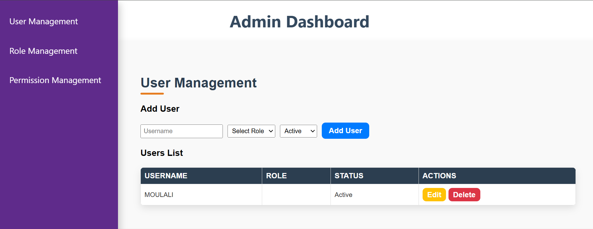
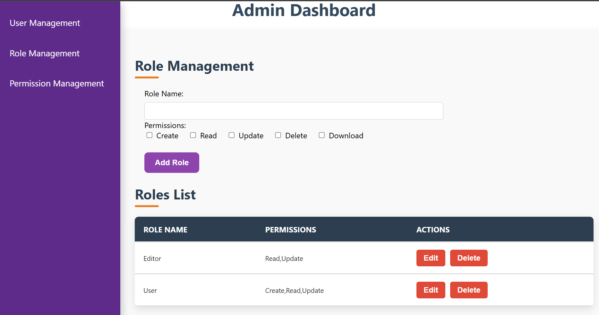
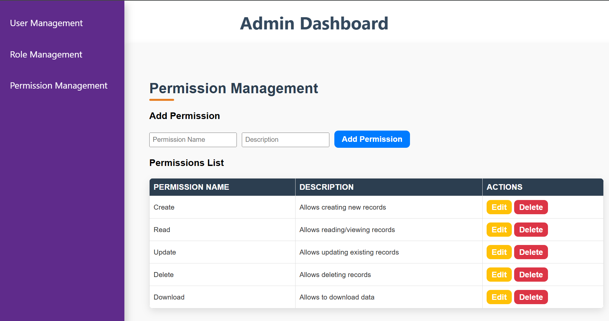
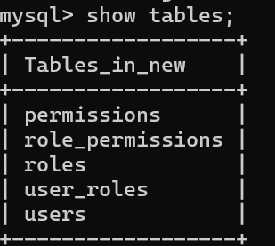

RBAC Admin Dashboard

Project Description:
The RBAC Admin Dashboard is a web-based admin panel for managing users, roles, and permissions. The dashboard provides an intuitive interface for administrators to manage users, define roles, and dynamically assign permissions.

Core Features:
User Management:
View, add, edit, and delete users.
Assign roles to users and manage their status (e.g., Active/Inactive).

Role Management:
Create and edit roles.
Roles can have permissions like Read, Write, and Delete or custom permissions.

Dynamic Permissions:
Easily assign or modify permissions for roles.
Display permissions clearly for easy understanding and modification.

Technologies Used:-

Frontend:
React.js for building the user interface.
CSS for styling the dashboard.

Backend:
Node.js for backend API handling.
MySQL as the database for storing users, roles, and permissions.

Follow these steps to set up the project locally:
1. Frontend Setup
    Create the React App using 
        npx create-react-app rbac-admin-dashboard
        cd  rbac-admin-dashboard

2. Install Frontend Dependencies:
    After setting up the React app, install the necessary dependencies:
        npm install      
        npm install axios

3. Backend Setup:
    create a backend directory and initialize it with the following steps:
        mkdir backend
        cd backend
        npm init -y
        npm install express mysql2 cors dotenv

4. Setup Database
    -> Open your MySQL command line or MySQL Workbench.
    -> Create the necessary database:
        CREATE DATABASE database_name;
        USE database_name;
    -> Create the Following tables;

            -- Create 'users' table
            CREATE TABLE users (
            id INT AUTO_INCREMENT PRIMARY KEY,
            username VARCHAR(255) NOT NULL UNIQUE,
            role_id INT,
            status ENUM('active', 'inactive') DEFAULT 'active',
            FOREIGN KEY (role_id) REFERENCES roles(id) ON DELETE SET NULL
            );

            -- Create 'roles' table
            CREATE TABLE roles (
            id INT AUTO_INCREMENT PRIMARY KEY,
            role_name VARCHAR(255) NOT NULL UNIQUE,
            description TEXT
            );

            -- Create 'permissions' table
            CREATE TABLE permissions (
            id INT AUTO_INCREMENT PRIMARY KEY,
            permission_name VARCHAR(255) NOT NULL UNIQUE,
            description TEXT
            );

            -- Create 'role_permissions' table (many-to-many relationship between roles and permissions)
            CREATE TABLE role_permissions (
            id INT AUTO_INCREMENT PRIMARY KEY,
            role_id INT,
            permission_id INT,
            FOREIGN KEY (role_id) REFERENCES roles(id) ON DELETE CASCADE,
            FOREIGN KEY (permission_id) REFERENCES permissions(id) ON DELETE CASCADE
            );

            -- Create 'user_roles' table (many-to-many relationship between users and roles)
            CREATE TABLE user_roles (
            id INT AUTO_INCREMENT PRIMARY KEY,
            user_id INT,
            role_id INT,
            FOREIGN KEY (user_id) REFERENCES users(id) ON DELETE CASCADE,
            FOREIGN KEY (role_id) REFERENCES roles(id) ON DELETE CASCADE
            );

        -> Use "Show tables" command to verify that the tables have been created successfully.
        -> And it will be looks like this.
            

* Run Server
    Frontend: npm start
    Backend: node server.js

Hence the application is ready to use. You can access frontned it by visiting `http://localhost:3000` and backend using `http://localhost:5000` 
